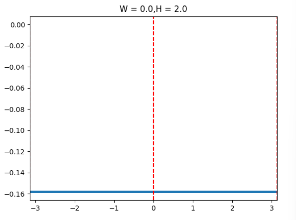
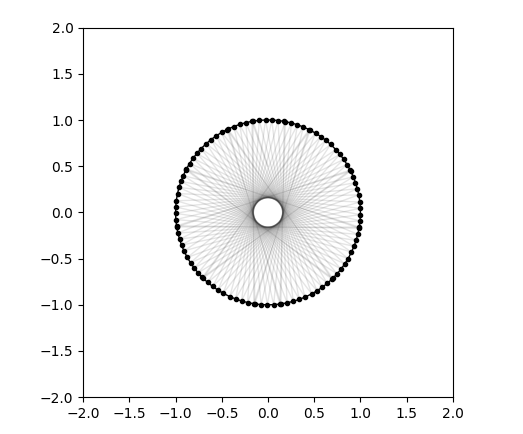
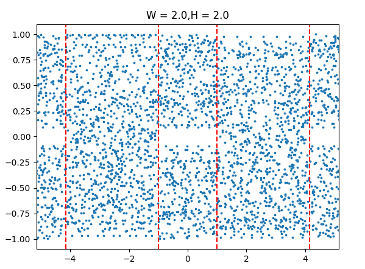
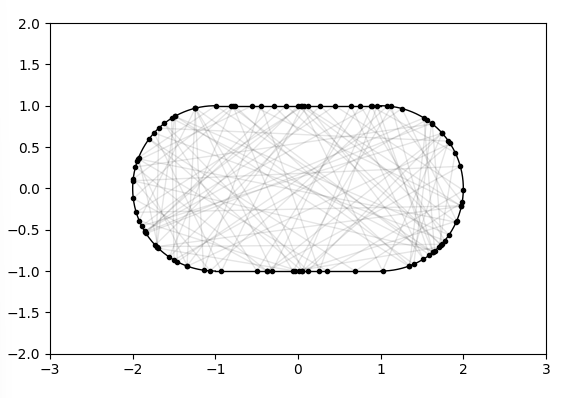

# 古典ビリヤード問題シミュレーション

ビリヤードの形状による粒子の振る舞いをシミュレーションし、ポアンカレ断面や軌道を可視化するプロジェクトです。

## 概要

**動力学的ビリヤード**とは、粒子が境界で鏡面反射しながら運動する力学系です。境界の形状によってカオス性の有無が決まり、積分可能系からエルゴード系まで様々な振る舞いを示します。

このプロジェクトでは以下の4種類のビリヤードを実装しています。

| 形状 | カオス性 | 特徴 |
|------|----------|------|
| 楕円 | なし（積分可能） | 焦点を通る軌道が保存される |
| 矩形（Rectangle） | なし（積分可能） | 速度成分が保存される |
| スタジアム（Bunimovich Stadium） | あり（エルゴード） | 矩形の両端を半円で置き換えた形状 |
| シナイ（Sinai Billiard） | あり（エルゴード） | 矩形の中心に円形障害物 |

## ポアンカレ断面

境界への衝突点を弧長座標 $s$（または角度 $\theta$）と反射角の正弦 $\sin\phi$ の組 $(s, \sin\phi)$ でプロットしたものです。

- **積分可能系**（楕円・矩形）: 軌道は曲線（不変トーラス）上に乗る
- **カオス系**（スタジアム・シナイ）: 軌道が位相空間を一様に埋め尽くす

### 円ビリヤード（W = 0, H = 2）— 積分可能

| ポアンカレ断面 | 軌道 |
|:-:|:-:|
|  |  |

$\sin\phi$ が一定の直線上に乗り、軌道が周期的であることがわかります。

### スタジアムビリヤード（W = 2, H = 2）— エルゴード

| ポアンカレ断面 | 軌道 |
|:-:|:-:|
|  |  |

点が位相空間全体に散らばり、カオス的な軌道になっていることがわかります。

## ディレクトリ構成

```
billiard_theory/
├── setting.py              # 描画設定・グラフ初期化
├── ellipse/
│   ├── ellipse_liner_system.py      # 楕円ビリヤードの軌道表示
│   └── ellipse_poincare_map.py      # 楕円ビリヤードのポアンカレ断面
├── squre/
│   ├── squre_liner_system.py        # 矩形ビリヤードの軌道表示
│   ├── squre_poincare_map.py        # 矩形ビリヤードのポアンカレ断面
│   ├── squre_particle_system.py     # 多粒子シミュレーション
│   └── squre_compare_system.py      # 比較シミュレーション
├── stadium/
│   ├── stadium_poincare_map_arc.py  # スタジアムのポアンカレ断面（弧長座標）
│   └── graph_data/                  # 生成した画像の保存先
│       ├── poincare_depend_w_h_arc/
│       └── poincare_depend_w_h_polar/
├── sinai/
│   ├── sinai_liner_system.py        # シナイビリヤードの軌道表示
│   └── sinai_compare_system.py      # 比較シミュレーション
└── func/                            # 各形状の計算モジュール
    ├── stadium/
    │   ├── find_intersection_reversion.py  # 衝突点計算
    │   ├── find_reflect_direction.py       # 反射方向計算
    │   ├── get_normal_vector.py            # 法線ベクトル計算
    │   ├── get_arc_length.py               # 弧長計算
    │   └── get_jacobian.py                 # ヤコビアン計算
    ├── squre/
    ├── sinai/
    ├── ellipse/
    └── calculate/
        ├── newton_method.py         # ニュートン法（交点の数値計算）
        └── vertical_vector.py       # 法線ベクトル計算
```

## 実行方法

```bash
# スタジアムビリヤードのポアンカレ断面と軌道
python stadium/stadium_poincare_map_arc.py

# 矩形ビリヤードのポアンカレ断面と軌道
python squre/squre_poincare_map.py

# 楕円ビリヤードのポアンカレ断面
python ellipse/ellipse_poincare_map.py

# シナイビリヤードの軌道
python sinai/sinai_liner_system.py
```

### パラメータ設定

各スクリプトの冒頭にあるパラメータを変更することで動作を調整できます。

**スタジアムビリヤード** （`stadium/stadium_poincare_map_arc.py`）:
```python
wall_width  = 2.0   # 矩形部分の幅 W（0.0 で円になる）
wall_height = 2.0   # 高さ H（半円の直径 = H）
position_1  = np.array([0.0, 0.5])   # 初期位置
velocity_1  = np.array([-0.05, 0.15])  # 初速度
```

`W = 0` のとき完全な円（積分可能）、`W > 0` で Bunimovich スタジアム（エルゴード）になります。

## 依存ライブラリ

- Python 3.x
- NumPy
- Matplotlib

```bash
pip install numpy matplotlib
```

## 座標系と物理量

- **弧長座標 $s$**: 境界を一周したときの弧長で衝突点を表す
- **反射角の正弦 $\sin\phi$**: 境界法線と入射方向のなす角の正弦（$-1 \leq \sin\phi \leq 1$）
- **境界分離線（赤点線）**: ポアンカレ断面上で矩形部分と半円部分の境界を示す

## 参考

- L. A. Bunimovich, "On the ergodic properties of nowhere dispersing billiards", Commun. Math. Phys. (1979)
- Ya. G. Sinai, "Dynamical systems with elastic reflections", Russian Math. Surveys (1970)
